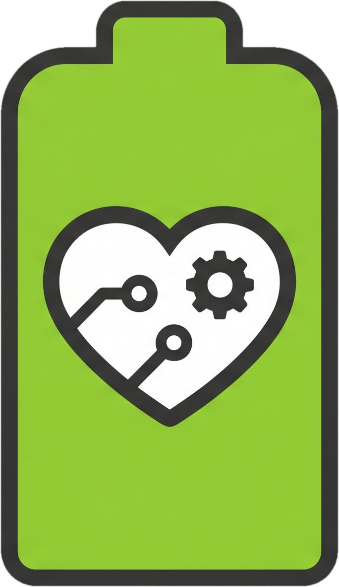
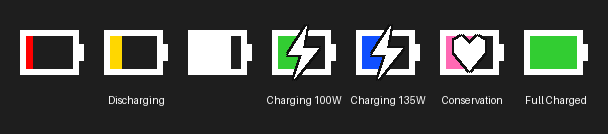

#  Y50 Battery Manager

A simple app that allows you to control the battery conservation mode, letting you charge it to a higher percentage than the default 60% limit.

To use this app, you must have the "Lenovo Energy Manager" installed on your PC, as it relies on its driver to control the battery conservation mode. The Lenovo app doesn't need to be running.

You can set two separate thresholds to switch between conservation and charging modes, further reducing charge cycles.

If you want to keep the default behavior (but at a higher percentage), you can set both thresholds to the same value. It is not possible to set a threshold lower than the default 60% imposed by the hardware conservation mode.

Since the application needs to communicate directly with the system driver, it must be run as Administrator.

It's tested on Windows 11 with a Lenovo Y50-70 laptop.